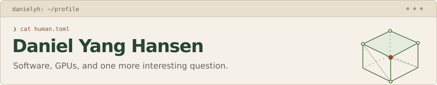

<a href="https://danielyanghansen.dev">
  <picture>
    <source media="(prefers-color-scheme: dark)" srcset="assets/header-dark.svg">
    <source media="(prefers-color-scheme: light)" srcset="assets/header-light.svg">
    
  </picture>
</a>

I'm a Norwegian software developer based in **Taipei, Taiwan**. I like understanding how things work, building something useful, and finding out where the time actually goes.

**[Explore my portfolio ↗](https://danielyanghansen.dev)** · [LinkedIn](https://www.linkedin.com/in/danielyanghansen) · [Say hello](mailto:daniel.yang.hansen@gmail.com)

## Things I work on

- **GPUs & systems** — C++, CUDA, Vulkan, Linux. GPU tooling at Arm; multi-GPU fluid simulation and performance modelling for my master's thesis at NTNU.
- **Software people use** — TypeScript, React, Vue, Python, Django. Nearly five years building and maintaining [Abakus Webkom](https://github.com/webkom)'s student platform, alongside summer internships in industry.
- **Things that make me curious** — 3D graphics, small games, and interactive explanations. Some of those experiments live in my portfolio's [Play section](https://danielyanghansen.dev/#play).

## A few places to start

| If you're curious about… | Start here |
| --- | --- |
| Multi-GPU performance | [Better locality wasn't enough](https://danielyanghansen.dev/notes/thesis-locality/) — what particle ordering and NCCL taught me about measuring the whole runtime. |
| Software built with a community | [Webkom](https://github.com/webkom) — the team I spent nearly five years building with. |
| My everyday setup | [dotfiles](https://github.com/danielyanghansen/dotfiles) — Linux, Neovim, tmux, and zsh. |

A little more background

- Computer Science at **NTNU**, specialising in Algorithms and Computer Systems. Master's thesis: *Performance Modeling of a WCSPH Proxy Application on Multi-GPU Systems*.
- Summer internships at **Arm**, **Sportradar**, **OmegaPoint Norge**, and **Norsk Helsenett**; previously a database architect at **DNV GL**.
- Teaching assistant in computing courses at NTNU, and acting and singing instructor with **Abakusrevyen**.

---

**Away from the keyboard:** daily runs, violin, video and board games, musicals, and sketch comedy. My cat Vivi is back in Norway, holding the fort.

*He/him. Usually asking one more question.*
